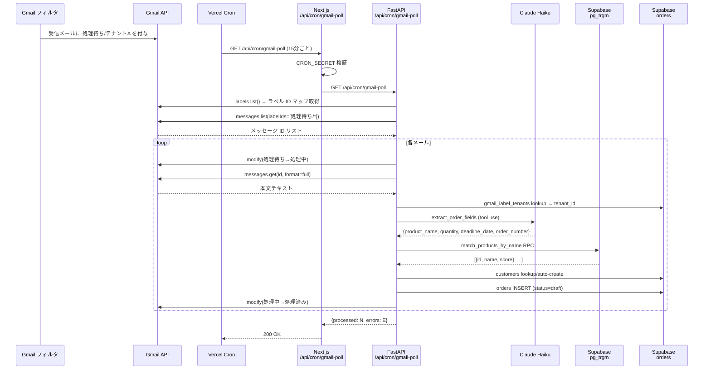

# Gmail → ProductPlanner 注文下書き作成 仕様

Gmail の受注メールを定期ポーリングし、Claude で注文情報を抽出して ProductPlanner に下書き (draft) として自動起票する機能の仕様。

---

## 概要

受注メールが届くたびに手動でシステムへ転記する作業を自動化する。  
LLM 解析の誤りに備え、起票は必ず **下書き状態** とし、担当者がレビュー・確定するワークフローを取る。

---

## システム構成

| コンポーネント | 役割 |
|---|---|
| Gmail フィルタ | 受信時に `処理待ち/{テナント名}` ラベルを自動付与 |
| Vercel Cron | 15 分ごとに Next.js API ルートを呼び出すスケジューラ |
| Next.js API Route | Cron Secret を検証し、Render バックエンドへリクエストを転送 |
| FastAPI (Render) | Gmail API 呼び出し・LLM 解析・注文下書き作成を実行 |
| Gmail API | ラベル別メール取得と状態ラベルの遷移管理 |
| Claude Haiku | メール本文から注文フィールドをツールユースで抽出 |
| pg_trgm (Supabase) | 抽出製品名テキストから DB 製品 ID を類似度検索 |
| Supabase | 下書き注文の永続化・テナント解決テーブル |

---

## ラベル設計

メールの処理状態を Gmail のネストラベルで管理する。

```
処理待ち/テナントA    ← Gmail フィルタが受信時に自動付与
処理中/テナントA      ← Cron 処理開始時に遷移（二重処理防止）
処理済み/テナントA    ← 正常完了時に遷移
エラー/テナントA      ← 例外発生時に遷移
```

プレフィックスは環境変数で変更可能（[環境変数一覧](#環境変数一覧) 参照）。  
テナント名部分は `gmail_label_tenants` テーブルで `tenant_id` に解決する。

---

## シーケンス図



---

## 処理フロー詳細

### 1. Vercel Cron トリガー

- スケジュール: `*/15 * * * *`（15 分間隔）
- 設定ファイル: [frontend/vercel.json](../../frontend/vercel.json)
- Vercel が自動で `Authorization: Bearer <CRON_SECRET>` を付与する

### 2. Next.js API Route (`/api/cron/gmail-poll`)

- `CRON_SECRET` を検証して不正リクエストを排除
- `BACKEND_URL` へリクエストを転送
- 実装: [frontend/src/app/api/cron/gmail-poll/route.ts](../../frontend/src/app/api/cron/gmail-poll/route.ts)

### 3. FastAPI エンドポイント (`GET /api/cron/gmail-poll`)

- `CRON_SECRET` を `secrets.compare_digest` でタイミング攻撃対策付き検証
- `get_supabase_admin_client()` で Service Role Key クライアントを生成し `poll_unread_emails(db)` を呼び出す
- 実装: [backend/app/routers/cron/gmail_poll.py](../../backend/app/routers/cron/gmail_poll.py)

### 4. Gmail ラベルポーリング

| 項目 | 詳細 |
|---|---|
| 取得対象 | `処理待ち/*` ラベルを持つメール全件 |
| 二重処理防止 | 取得直後に `処理待ち → 処理中` へ遷移 |
| ページング | `nextPageToken` によるページ送り（最大 500 件/回） |
| エラー時 | メール単位でキャッチし `処理中 → エラー` へ遷移。他メールの処理は継続 |

実装: [backend/app/services/gmail_service.py](../../backend/app/services/gmail_service.py)

### 5. テナント解決

`処理待ち/テナントA` ラベルのサフィックス（`テナントA`）を `gmail_label_tenants` テーブルに問い合わせ `tenant_id` (UUID) を取得する。  
エントリが存在しない場合はエラーとして処理を中断し `エラー` ラベルへ遷移する。

### 6. Claude による注文フィールド抽出

メール本文を Claude Haiku に渡し、`extract_order_fields` ツールを強制呼び出しで構造化抽出する。

| フィールド | 型 | 抽出不可時 |
|---|---|---|
| `product_name` | `string \| null` | null のまま起票 |
| `quantity` | `integer \| null` | null のまま起票 |
| `deadline_date` | `string (YYYY-MM-DD) \| null` | null のまま起票 |
| `order_number` | `string \| null` | null のまま起票 |

使用モデル: `EMAIL_EXTRACTION_MODEL` 環境変数（デフォルト: `claude-haiku-4-5-20251001`）  
実装: [backend/app/services/email_extraction_service.py](../../backend/app/services/email_extraction_service.py)

### 7. 製品 ID 解決（pg_trgm）

抽出した `product_name` を `match_products_by_name` RPC に渡し、類似度スコアで候補を取得する。

| 候補件数 | 処理 |
|---|---|
| 1 件 | `product_id` を自動確定 |
| 複数件 | `product_id = null`、`product_candidates` JSONB に上位 N 件を格納 |
| 0 件 | `product_id = null`、`product_candidates = null` |

```json
// product_candidates 格納例
[
  {"product_id": 12, "name": "アルミ板 A2024-T3", "score": 0.82},
  {"product_id": 7,  "name": "アルミ板 A6061-T6", "score": 0.71}
]
```

| 環境変数 | デフォルト | 用途 |
|---|---|---|
| `PRODUCT_MATCH_THRESHOLD` | `0.3` | 閾値未満の候補を除外 |
| `PRODUCT_MATCH_TOP_N` | `5` | UI 表示件数上限（DB クエリは全件取得） |

実装: [backend/app/services/product_matching_service.py](../../backend/app/services/product_matching_service.py)

### 8. 顧客 ID 解決

本文の転送ブロックから送信元メールアドレスを正規表現で抽出する。  
英語 (`From: Name <addr@example.com>`) と日本語 (`差出人: addr@example.com`) の両形式に対応。

```
extract_sender_email(body) → "customer@example.com"
  ↓
customers テーブルで (tenant_id, email) 検索
  ↓ 存在する → customer_id を利用
  ↓ 存在しない → email・name="email値" で draft 顧客を自動作成
```

実装: [backend/app/services/customer_matching_service.py](../../backend/app/services/customer_matching_service.py)

### 9. 注文下書き作成

```json
{
  "tenant_id": "<uuid>",
  "source_type": "email",
  "source_raw": "<メール本文全体>",
  "status": "draft",
  "product_id": 12,
  "quantity": 50,
  "deadline_date": "2026-07-31",
  "order_number": "PO-2026-001",
  "extracted_product_name": "アルミ板 A2024",
  "product_candidates": [...],
  "customer_id": 8
}
```

- `source_type: "email"` で手動起票と区別できる
- `source_raw` に原文を保存し、解析ミス時の確認・修正を可能にする
- `product_id` / `quantity` は nullable（抽出失敗時に担当者が補完）

---

## DB スキーマ変更

マイグレーションファイル: [supabase/migrations/20260618000000_gmail_intake_v2.sql](../../supabase/migrations/20260618000000_gmail_intake_v2.sql)

### orders テーブル

| カラム | 変更内容 |
|---|---|
| `product_id` | NOT NULL → NULL 許可 |
| `quantity` | NOT NULL → NULL 許可 |
| `extracted_product_name` | `text` 追加（Claude 抽出生テキスト） |
| `product_candidates` | `jsonb` 追加（pg_trgm 候補リスト） |

### gmail_label_tenants テーブル（新規）

| カラム | 型 | 説明 |
|---|---|---|
| `id` | `uuid` | PK |
| `label_name` | `text UNIQUE` | テナント名（例: `テナントA`） |
| `tenant_id` | `uuid` | FK → tenants.id |

RLS 有効。Cron は Service Role Key でアクセスするため RLS ポリシーは不要。

### products テーブル

- GIN インデックス追加: `products_name_trgm_idx` (gin_trgm_ops) — 類似度検索の高速化
- pg_trgm 拡張: `CREATE EXTENSION IF NOT EXISTS pg_trgm`

### match_products_by_name RPC

```sql
SELECT id, name, similarity(name, query_text) AS score
FROM products
WHERE tenant_id = p_tenant_id
  AND similarity(name, query_text) >= similarity_threshold
ORDER BY score DESC;
```

---

## 認証・セキュリティ

| 項目 | 方式 |
|---|---|
| Cron 認証 | `CRON_SECRET` Bearer トークン（`secrets.compare_digest` でタイミング攻撃対策） |
| Gmail 認証 | OAuth2 Refresh Token |
| Gmail スコープ | `https://www.googleapis.com/auth/gmail.modify`（読み取り＋ラベル変更のみ） |
| Supabase アクセス | Service Role Key（Secret Manager 管理必須。アプリコード内での直接参照禁止） |
| Claude API キー | `ANTHROPIC_API_KEY`（Secret Manager 管理必須） |

環境変数の取得・設定手順: [docs/infra/env-setup-gmail-cron.md](../infra/env-setup-gmail-cron.md)

---

## 環境変数一覧

| 変数名 | デフォルト | 説明 |
|---|---|---|
| `GMAIL_CLIENT_ID` | — | Gmail OAuth2 クライアント ID |
| `GMAIL_CLIENT_SECRET` | — | Gmail OAuth2 クライアントシークレット |
| `GMAIL_REFRESH_TOKEN` | — | Gmail OAuth2 リフレッシュトークン |
| `GMAIL_LABEL_PREFIX_PENDING` | `処理待ち` | 処理待ちラベルプレフィックス |
| `GMAIL_LABEL_PREFIX_PROCESSING` | `処理中` | 処理中ラベルプレフィックス |
| `GMAIL_LABEL_PREFIX_DONE` | `処理済み` | 処理済みラベルプレフィックス |
| `GMAIL_LABEL_PREFIX_ERROR` | `エラー` | エラーラベルプレフィックス |
| `CRON_SECRET` | — | Vercel Cron 認証トークン |
| `ANTHROPIC_API_KEY` | — | Claude API キー |
| `EMAIL_EXTRACTION_MODEL` | `claude-haiku-4-5-20251001` | 使用する Claude モデル |
| `PRODUCT_MATCH_THRESHOLD` | `0.3` | pg_trgm 類似度閾値 |
| `PRODUCT_MATCH_TOP_N` | `5` | 候補表示上限件数 |
| `SUPABASE_SERVICE_ROLE_KEY` | — | Cron 用 Service Role Key（Secret Manager 管理） |

---

## 注文レビューフロー（運用）

```
[Gmail 受信]
    ↓ Gmail フィルタ
[処理待ち/テナントA ラベル付与]
    ↓ Vercel Cron (15分ごと)
[Claude 抽出 → pg_trgm マッチ → draft 注文作成]
    ↓
[処理済み/テナントA ラベル付与]
    ↓
[担当者が ProductPlanner でレビュー]
    ↓
[確定] または [フィールド修正して確定]
```

- `source_type === "email"` の注文は一覧で識別できるようにする（UI 実装は #168）
- `product_candidates` を参照して担当者が正しい製品 ID を選択できる
- `source_raw` を参照して解析ミスを人間が修正できる

---

## 実装状況

| フェーズ | 機能 | 状況 |
|---|---|:---:|
| 基盤 | DB: `order_number` nullable / `source_type` / `source_raw` 追加 | ✅ #155 |
| 基盤 | Backend: `OrderCreate` スキーマ更新 | ✅ #155 |
| 基盤 | Frontend: 注文番号任意化・メール本文表示 UI | ✅ #155 |
| Cron | Vercel Cron ジョブ定義 (15 分間隔) | ✅ #165 |
| Cron | Next.js API Route（転送ハンドラ） | ✅ #165 |
| Cron | FastAPI エンドポイント + Gmail ラベルポーリング | ✅ #165 |
| DB | pg_trgm 拡張・GIN インデックス・`match_products_by_name` RPC | ✅ #165 |
| DB | `gmail_label_tenants` テーブル | ✅ #165 |
| DB | `orders.product_id` nullable / `extracted_product_name` / `product_candidates` 追加 | ✅ #165 |
| 解析 | Claude Haiku によるメール本文フィールド抽出 (`email_extraction_service.py`) | ✅ #166 |
| 解析 | pg_trgm 製品 ID 解決 (`product_matching_service.py`) | ✅ #167 |
| 解析 | 転送ブロック解析 + 顧客 ID 解決/自動作成 (`customer_matching_service.py`) | ✅ #167 |
| UI | メール起票注文の一覧フィルタ・バッジ表示・製品候補選択 | ❌ #168 |

---

## 関連ドキュメント

- [メール起票による注文入力設計](../features/email-order-intake.md)
- [Gmail OAuth セットアップ](../infra/gmail-oauth-setup.md)
- [Gmail Cron 環境変数セットアップ](../infra/env-setup-gmail-cron.md)
